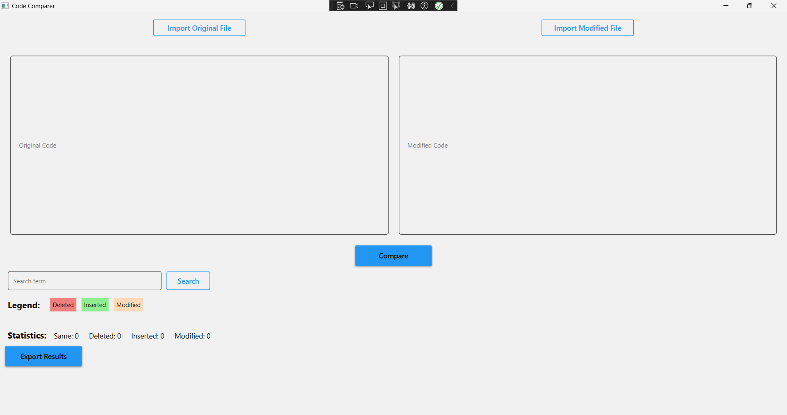
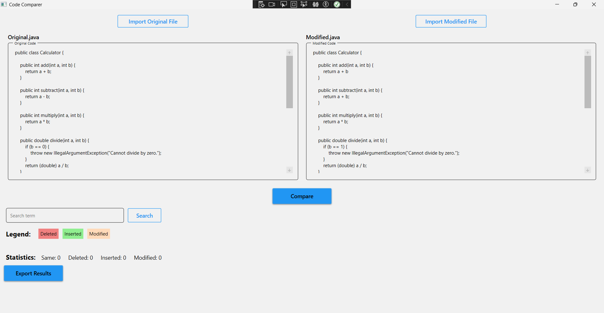
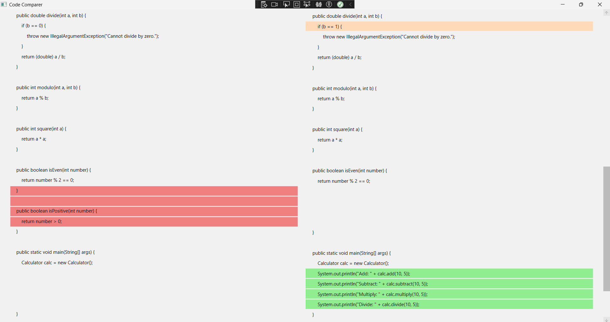
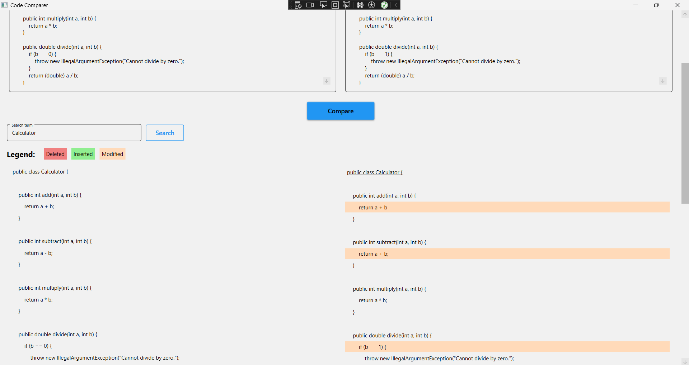
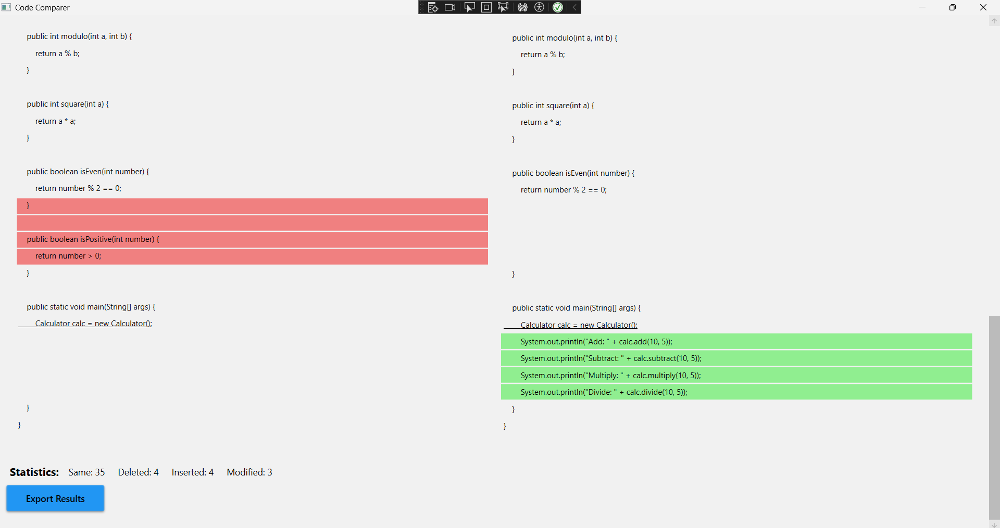
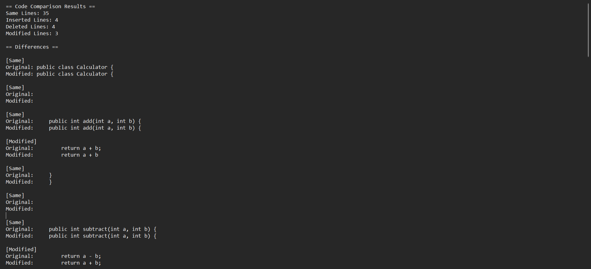

# CodeComparer – Code Difference Viewer

**CodeComparer** is a WPF desktop application for visually comparing differences between two blocks of source code. It highlights changes, shows statistics, supports file import/export, and allows keyword search within code.

---

## ✨ Features

### 🔹 Load Code Blocks

* You can **manually paste code** into the input fields or **import code from files** (`.cs`, `.txt`, `.java`, `.py`, etc.).
* The name of the imported file is displayed above each code block for clarity.

### 🔹 Code Comparison

* The app compares the two blocks line by line and aligns them side-by-side.
* It detects and displays:

  * **Inserted lines** (green),
  * **Deleted lines** (red),
  * **Modified lines** (orange),
  * and unchanged lines.

### 🔹 Visual Highlighting

* Differences are color-coded:

  * 🟥 Deleted lines – `LightCoral`
  * 🟩 Inserted lines – `LightGreen`
  * 🟧 Modified lines – `PeachPuff`
* You can quickly spot where changes occurred.

### 🔹 Search

* You can search for any term or keyword.
* Matching lines are underlined to improve visibility in large files.

### 🔹 Statistics Summary

* The app shows the number of:

  * Same lines
  * Inserted lines
  * Deleted lines
  * Modified lines

### 🔹 Export Results

* After comparing, you can **export the comparison results** to a `.txt` file.
* The exported file contains:

  * Summary statistics
  * A full list of differences with labels

---

## 🛠️ Technologies Used

* **WPF** (Windows Presentation Foundation)
* **MVVM** architecture
* **DiffPlex** for code comparison logic
* **MaterialDesignInXAML** for modern UI components

